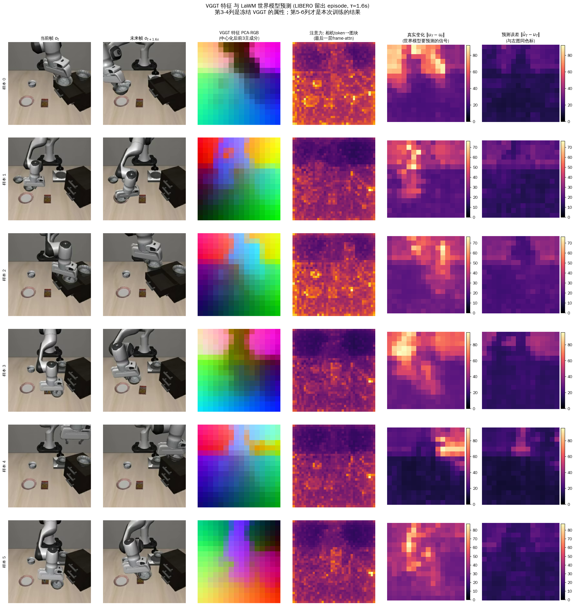
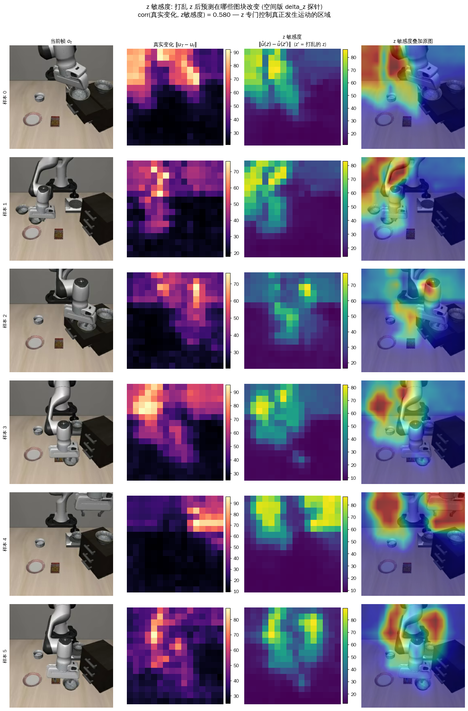
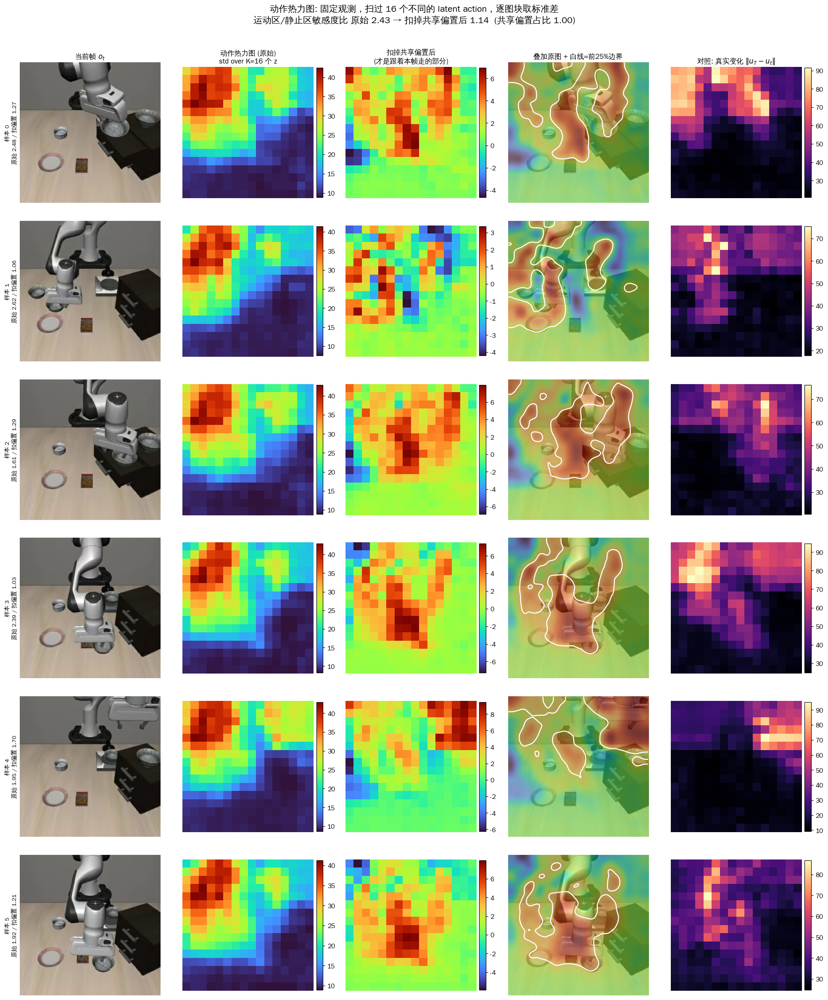
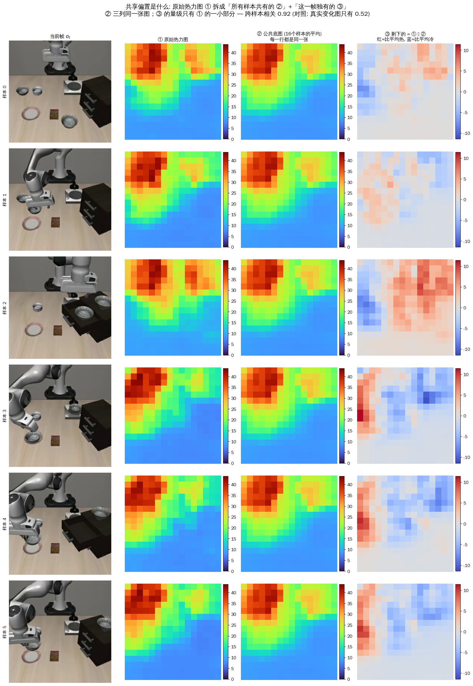
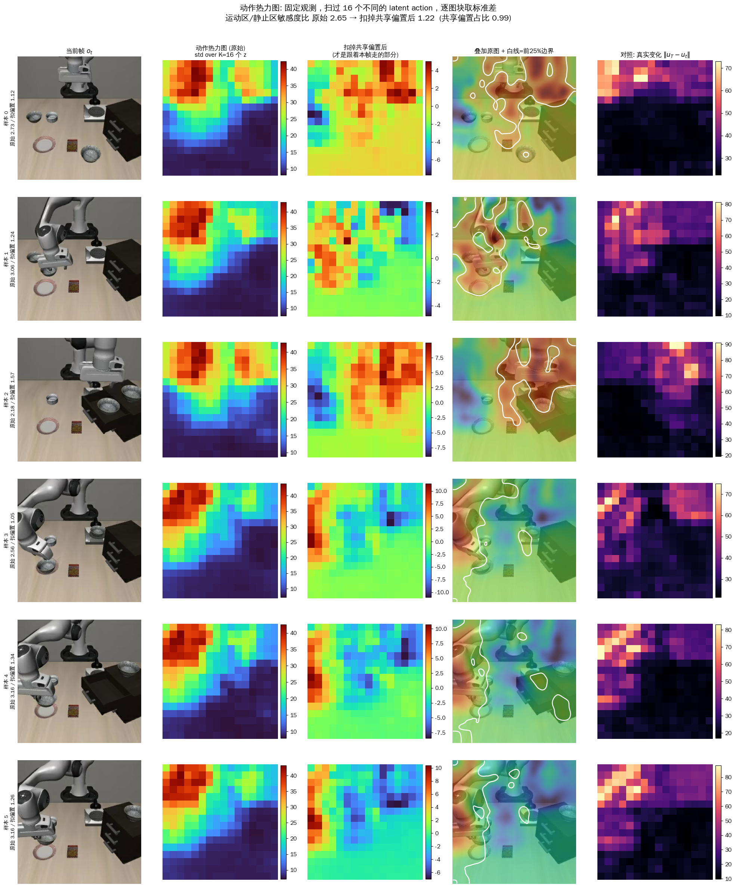

# LaWAM Stage 1 复现：把冻结视觉编码器从 DINOv3 换成 VGGT-1B

> 状态：**已完成并验证通过**
> 训练 2026-08-22 01:20 → 08-24 02:28（约 56 h，8×A100-80G）
> 最终权重 `/home/ma-user/work/lam_runs/vggt_vae_libero/checkpoints/epoch=39.ckpt`

---
## 1. 做了什么

在官方 LaWAM 仓库（https://github.com/RLinf/LaWAM ，本地 `WAM/LaWAM_official/`，是 StarVLA 的 fork）
上复现 Stage 1，**其它一切不变，只把冻结的视觉编码器从 DINOv3 换成 VGGT-1B**。

不涉及 Stage 2（VLM policy prior、action expert、GE-Act 集成）——那是后续工作。

Stage 1 训练的是一个 latent-action-conditioned 世界模型：

```
o_t   ─┐                                      ┌─ enc 流 (aug A) ─┐
       ├─ VGGT-1B (冻结) ─ pool 16×16 ─ LN ────┤                  ├→ IDM(24L) → z [B,1,32]
o_t+τ ─┘                                      └─ dec 流 (aug B) ─┘        │
                                                       │                  │
                                           u_dec_t ────┴──→ LaWM decoder(12L, AdaLN(z)) → û_T
                                                                          │
                                           s_t ──────────→ StateHead(s,z) → Δŝ
L = smooth_l1(û_T, u_T) + λ_aux·‖Δŝ − Δs‖² + β·KL
```

τ = 1.6 s（`frame_dt_sec`，20 fps → stride 32 帧）。

---

## 2. 结论：成功了

三个判据全部通过，且不是勉强过线。**在 84 个留出 episode / 640 样本上评估，全部在标准化特征空间计算。**

| 判据 | 结果 | 目标 | 判定 |
|---|---|---|---|
| 击败所有平凡基线 | mse 0.1586 vs identity 0.5496 vs mean 1.0000 | < 两者 | ✅ 好 3.5× |
| `delta_z`（打乱 z） | **0.3822**（相对提升 241%） | > 0.02，理想 > 0.1 | ✅ 超 19× |
| `z2action_r2`（线性探针） | **0.5523** | > 0.30 | ✅ |

**最干净的一个发现**：把 z 打乱后 MSE 掉到 **0.5408**，几乎正好等于恒等基线 **0.5496**。
即：没有正确的 z，decoder 就退化成"抄袭输入"——**模型相对恒等基线的全部增益都来自 z**。
这比单看 delta_z 的数值更有说服力。

空间版的探针见 §11。结论需要打个折：`corr(真实变化, z敏感度) = 0.58~0.71` 看起来 z 控制的
正是画面里在动的区域，但**不同样本的热力图之间相关高达 0.93**
（对照：真实变化图只有 0.54），扣掉这张公共图后对齐几乎完全消失
（运动区/静止区比值 2.43 → 1.14）。
即：**z 学到的是"动作一般发生在画面哪片区域"的固定先验，不是"这一帧机械臂在哪"**。
详见 §11.3。这不影响 Stage 2（`z2action_r2` 直接在动作向量上测，与空间无关），
但"latent action 在空间上定位了机械臂"这个说法不成立，别写进结论。

`epoch=39.ckpt` 可直接交给 Stage 2（`load_latent_action_model` 已验证可加载）。

---

## 3. 为什么需要这三个探针，而不是只看 loss

这是本次复现最重要的方法论点，也是训练期间几乎所有中间汇报**都没有回答**的问题。

训练日志给的是 `val/recon_loss = 0.056`、`val/cos_sim_metric = 0.992`。这两个数字
**只证明世界模型能预测未来 VGGT 特征，完全不证明 z 里有动作信息**——两者可以彻底脱钩：
decoder 可能压根没在用 z，只是学了"抄袭输入 + 一个平均运动先验"。

VGGT 特征让这种作弊格外容易。动手前实测过：

```
原始 VGGT 余弦是秩反转的
  cos(u_t, u_t+K) = 0.853     cos(跨 episode) = 0.871   ← 无关样本反而更像
  ‖平均 token‖ = 76.4   vs   平均残差范数 = 43.5
  → 每个 token 有约 75% 是所有 token 共享的同一个常量
```

所以：

- **所有 MSE / cosine 必须在标准化（中心化）空间计算**，否则数字有误导性。
  评估脚本里 `mse_mean` 恒等于 1.00 就是这个标准化的自检。
- **`cos_sim_metric = 0.992` 本身几乎没有信息量**，恒等映射也能刷出很高的原始 cosine。

三个探针分别堵住一个漏洞：

| 探针 | 堵住的漏洞 |
|---|---|
| 与 identity / mean 基线对比 | 模型是不是只在抄袭输入 |
| `delta_z` = mse(打乱 z) − mse(正常) | decoder 是不是根本没用 z |
| z → action ridge 回归 R² | z 里的信息能不能被下游**线性**取用 |

第三个是 Stage 2 能否成立的直接前提：Stage 2 训练策略去输出 z，
若连线性映射都解不出动作，任何策略都恢复不出来。

**探针必须按 episode 切分训练/测试**，不能按帧——相邻帧近似重复，帧级切分什么都测不出来。

---

## 4. 评估完整输出

```
[eval] ckpt=/home/ma-user/work/lam_runs/vggt_vae_libero/checkpoints/epoch=39.ckpt
[eval] encoder=VGGTEncoder input_dim=2048
[eval] N=640 samples | z dim=32

=== 特征空间基线 (标准化后) ===
  mse_pred     = 0.1586   <- 模型预测
  mse_mean     = 1.0000   <- 预测数据集均值 (定义上=1.00)
  mse_identity = 0.5496   <- 预测 u_t (抄袭输入)
  => 击败所有平凡基线: YES
  cos_pred_gt   = 0.9189  (预测 vs 真实未来)
  cos_init_gt   = 0.7377  (当前 vs 真实未来)
  cos_pred_init = 0.7607  (预测 vs 当前)

=== Probe 1: delta_z (打乱 z 重新解码) ===
  mse_pred     = 0.1586
  mse_shuffled = 0.5408
  delta_z      = 0.3822   (相对提升 240.9%)
  => z 是否在驱动预测: YES

=== Probe 2: z -> 真实动作 线性探针 (ridge, R^2) ===
  对齐样本 491 | z 32维 -> action 56维
  episode 级切分: train 334 / test 157 样本, 84 episodes
  best ridge lambda=0.01
  z2action_r2  = 0.5523
  => YES
```

三条 cosine 曲线的形状是对的（论文 Fig.10 要的形状）：
`cos_pred_gt (0.919) > cos_init_gt (0.738)`，且 `cos_pred_init (0.761)` 没有反超——
模型预测的东西比当前帧更接近未来帧。

复现方式：
```bash
cd /home/ma-user/work/dataset/xxd-dataset/dataset_yhw/WAM/LaWAM_official
PYTHONPATH=$PWD PYTHONDONTWRITEBYTECODE=1 TMPDIR=/home/ma-user/work/tmp \
CUDA_VISIBLE_DEVICES=0 /home/ma-user/work/dataset/xxd-dataset/dataset_yhw/StarVLA/envs/starVLA/bin/python \
  tools/eval_lam_probes.py --n-batches 40
```

---

## 5. 代码改动：3 个文件

`git diff --stat`：285 行新增，1 行删除。
**`lam_model.py` 的 `_run`、`video_aug.py`、dataloader、`mixtures.py` 全部零改动。**

### 5.1 `latent_action_model/core/vjepa_encoder.py`（+248）

新增 `VGGTEncoder` 类，并在 `build_vision_encoder()` 工厂里加一个 `"vggt"` 分支。
它与 `DINOv3Encoder` 完全同构（同样的 `.encode(images, remove_cls, n)` 签名、
`feature_dim` / `latent_norms` / `train()` 锁 eval），所以下游一行都不用改。

四个 DINOv3 → VGGT 的真实落差，全部在这个类内部消化：

| 落差 | 处理 |
|---|---|
| `video_aug` 已做 ImageNet 归一化，但 VGGT aggregator **内部还会再做一次**且要求 [0,1] | 先反归一化回 [0,1] |
| VGGT 是 patch-14@518 → 37×37，而 LAM 硬编码 `LAM_PATCH_SIZE=16` | `adaptive_avg_pool2d` 37×37→16×16，保持 256 token |
| **VGGT 的 global attention 跨 S 维混合所有帧**，而 `_run` 把 4 帧拼成一次 `encode` 调用 → 会泄漏未来 | 内部强制 **S=1**，所有帧压到 batch 维 |
| aggregator 只缓存 block {4,11,17,23}，其余返回 `None`，config 的 `-2` 会直接拿到 `None` | 索引压缩后的已缓存列表：`-1`→block 23，`-2`→block 17 |

第三条是**承重的**，实测验证过：

```
batch 维堆叠: max|Δ| = 0.0            ← 逐位相同，安全
S 维堆叠:     max|Δ| = 20.3, cos = 0.9796   ← 未来帧污染了当前特征
```

`tools/check_vggt_encoder.py` 里有这条回归测试，防止后人"优化"成一次调用。

### 5.2 `latent_action_model/core/lam_lightinng.py`（+28）

`on_save_checkpoint` / `on_load_checkpoint` 一对钩子，存盘时剥掉
`lam.vision_encoder.*`（909 M 冻结参数），加载时从活模块补回去。

**ckpt 11 GB → 7.3 GB。** 加载时补回而不是放宽 strict，这样 strict 依然是 strict 的，
不会把真正缺失的训练权重一起放过。

### 5.3 `latent_action_model/core/lam_model.py`（+10）

`load_latent_action_model` 里跳过 `vision_encoder.` 开头的 missing key（已由
`__init__` 从 `vision_model_id` 重建），并在 `load_state_dict(strict=True)` 前补齐。

### 5.4 新增文件

```
latent_action_model/config/vggt_vae.yaml   从 dino_large_vae.yaml 派生，偏离处全标 # [VGGT]
tools/check_vggt_encoder.py                VGGTEncoder 单元验证
tools/check_lam_vggt_forward.py            真 LatentLAMModel 前向+反向验证
tools/eval_lam_probes.py                   本文档第 4 节的评估
tools/viz_vggt_lam.py                      §11.1 / §11.2 两张图
tools/viz_action_heatmap.py                §11.3 动作热力图 + 共享偏置诊断
```

---

## 6. 配置：相对官方 `dino_large_vae.yaml` 的偏离

只有 6 项，全部在 yaml 里用 `# [VGGT]` 标注：

| 项 | 官方 | 本次 | 原因 |
|---|---|---|---|
| `vision_model_id` | dinov3-vitb16 | VGGT-1B 本地路径 | 核心改动 |
| `data_root_dir` / `data_mix` | `/mnt/xx/xx` / `lam_plus_human` | 本地 / `libero` | 数据在哪 |
| `batch_size` | 64 | **32** | 实测 4.5 s/step、43 GB；64 会 ~9 s/step、~80 GB |
| `max_epochs` | 10 | **40** | LIBERO 比论文数据量小约 700× |
| `val_check_interval` | 10000 | **1.0** | 绝对步数必须小于每 epoch batch 数，8 卡下只有 1068，会抛 ValueError |
| ckpt/log `dirpath` | 默认（仓库内） | `/home/ma-user/work/lam_runs` | 仓库所在卷曾满且是 root-squash NFS，禁止 `rename()` |
| `every_n_epochs` | 1 | **4** | 7.3 GB/个，40 epoch 否则 300 GB |

模型结构参数（`dim` 1024、`enc_layers` 24、`dec_layers` 12、`code_dim` 32、`num_queries` 1、
`latent_layer_to_use` -2、`vq_type` vae、`lambda_aux` 1.0、`lr` 3e-4、`frame_dt_sec` 1.6）
**全部沿用官方值未改**。

参数量：**trainable 644.6 M / frozen (VGGT) 909.1 M / total 1.6 B**。

---

## 7. 训练曲线（全 40 epoch）

`val/recon_loss`：

```
ep0  0.130   ep10 0.0644  ep20 0.0577  ep30 0.0562
ep1  0.105   ep11 0.0707  ep21 0.0596  ep31 0.0580
ep2  0.0974  ep12 0.0672  ep22 0.0604  ep32 0.0607
ep3  0.0881  ep13 0.0640  ep23 0.0607  ep33 0.0586
ep4  0.0806  ep14 0.0696  ep24 0.0526 ←最低  ep34 0.0567
ep5  0.0798  ep15 0.0615  ep25 0.0564  ep35 0.0559
ep6  0.0788  ep16 0.0617  ep26 0.0609  ep36 0.0550
ep7  0.0736  ep17 0.0706  ep27 0.0568  ep37 0.0542
ep8  0.0771  ep18 0.0618  ep28 0.0547  ep38 0.0633
ep9  0.0722  ep19 0.0577  ep29 0.0562  ep39 0.0561
```

- `val/cos_sim_metric`：0.970 → 0.992
- `val/state_loss`：0.0218 → 3.9e-4（辅助头确实在学）
- 最终 train 0.0419 / val 0.0561，**gap 1.34×**，全程稳定在 1.2~1.6，**无过拟合**
- 最低点 ep24 = 0.0526，但 ep24~ep39 都在 0.053~0.063 窄幅震荡，选哪个差别不大

**注意：训练期的 val 集只有 109 个样本**（`val_tail_ratio: 0.001` 从 1693 episodes 里切 1 条），
±0.005 的抖动纯属噪声。我在训练期间据此判断过两次"疑似收敛"，都被后续 epoch 推翻
（ep5-7 一次、ep13-17 一次）。**这个规模的验证集不适合做早停决策。**
第 4 节的评估用了 5% 留出（84 episodes），数字才可信。

---

## 8. 环境与数据

### 数据
`jialei02/libero_merged_no_noops_20hz`（HF），**LeRobot v3.0**，1.97 GB，
1693 episodes / 273,465 帧 / 20 fps，在 `/home/ma-user/work/lam_datasets/`。

⚠️ **本地那份 LIBERO 是 v2.1，官方 fork 的 `datasets.py` 只认 v3.0**
（要 `meta/tasks.parquet` + `meta/episodes/*/*.parquet`）。别浪费时间改 loader，
直接拉官方那份，只有 2 GB。走 `HF_ENDPOINT=https://hf-mirror.com`。

### 环境
`/home/ma-user/work/dataset/xxd-dataset/dataset_yhw/StarVLA/envs/starVLA`（python3.10）。torch 2.6.0 / torchvision 0.21.0
与官方 requirements 一致，vggt 已装。

⚠️ **装 lightning / jsonargparse / datasets 时动了这个共享 env**：
`pyarrow 14.0.1→25.0.1`、`fsspec 2026.6.0→2025.10.0`、`packaging 26.0→24.2`。
StarVLA / SF 那摊活若出怪问题，先查这三个。

pip 在沙箱内会被网络中断打断，需要 `dangerouslyDisableSandbox`。

### 运行
```bash
/home/ma-user/work/lam_runs/launch_vggt_lam.sh   # 自动检测 last.ckpt 续训
```
日志 `/home/ma-user/work/lam_runs/train.log`，权重 `.../vggt_vae_libero/checkpoints/`。

---

## 9. 踩过的坑

1. **wandb-core 在这台机器起不来** → 必须 `LAM_ENABLE_MANUAL_WANDB=0 WANDB_MODE=disabled`。
2. **官方 `train.sh` 里硬编码了一个真实的 `WANDB_API_KEY`**（上游自己泄的）。没用它，
   但正式使用前建议改掉。
3. **`xxd-dataset` 卷（804 T 共享）一度 100% 满**，会让 Bash 工具丢输出。全程靠
   重定向到 `/home/ma-user/work` 再读文件绕过。参见 `[[tmp-overlay-full-kills-bash-tool]]`。
4. **ckpt 路径必须显式指定**，默认会写进仓库所在的满卷 + root-squash NFS（禁止 rename）。
   参见 `[[dataset-yhw-nfs-no-rename]]`。
5. **`PermissionError: Operation not permitted` 在日志里出现了 416 次**——全是
   `multiprocessing.util._remove_temp_dir` → `shutil.rmtree` 在 NFS 上清理 worker 临时目录，
   发生在数据交付**之后**的析构阶段，**对训练无影响**。别被吓到。
6. **监控命令的自指陷阱**：用 `pgrep -f "…latent_action_model.main…"` 检测训练进程，
   会匹配到**执行这条命令的 bash 自己**（命令行里含该字面量）。踩了三次才修对，
   正解是按进程名匹配：`ps -eo pid,comm | awk '$2=="pt_elastic"'`。

---

## 10. 已知偏离论文之处（写结果时需声明）

1. **数据量差约 700×**（273 K 帧 vs 论文 3000 h + 1500 h），
   跨本体泛化（论文 Fig.5）本次复现覆盖不到——只有 LIBERO 单一本体（Franka）。
2. **无人类第一人称视频**。
3. **单视角**：官方 dataloader `random_single_non_wrist_view=True`，每样本只取一个非腕部相机。
   （曾考虑改成 primary + wrist 双视角，但那违背"其它不变"，最终沿用官方行为。）
4. **τ = 1.6 s**，取自官方 config；论文正文写的是 1.2 s。
5. **β（KL 权重）= 5e-5**，是 `VAEQuantizer` 的类默认值；论文写的是 1e-5。
   shipped config 只传了 `vq_kwargs: {layer_norm: true}`，没覆盖 beta。
6. `perplexity = 0.000` 全程为 0 是**正常的**——用的是 VAE 连续 latent 而非 VQ 码本，
   这个指标在该路径下无意义。

---

## 11. 可视化：VGGT 看到了什么，世界模型学到了什么

生成脚本 `tools/viz_vggt_lam.py`，两张图在 `docs/figs/`，
原件在 `/home/ma-user/work/lam_runs/viz/`。复现：

```bash
cd /home/ma-user/work/dataset/xxd-dataset/dataset_yhw/WAM/LaWAM_official
HF_ENDPOINT=https://hf-mirror.com PYTHONDONTWRITEBYTECODE=1 TMPDIR=/home/ma-user/work/tmp \
CUDA_VISIBLE_DEVICES=0 /home/ma-user/work/dataset/xxd-dataset/dataset_yhw/StarVLA/envs/starVLA/bin/python \
  tools/viz_vggt_lam.py --n-samples 6 --seed 0
```

### 读图前必须知道的三件事

1. **6 行不是 6 个独立场景。** 六行的桌子、盘子、小方块、黑柜子位置完全一样，
   只有机械臂姿态在连续变化——val loader 没打乱，这是同一段（或相邻）episode
   沿时间往前走的 6 个切片。**行号 ≈ 时间**。
2. **图一第 5、6 列共用一个色标**（`vmax = max(chg, err)`，每行各自算），
   所以**同一行内**"真实变化"和"预测误差"可以直接比亮度；**跨行不能比**。
3. **图二每个小图的色标是各自自动缩放的**，只能看"哪块亮"，不能看"有多亮"。

### 11.1 图一 `vggt_features_and_prediction.png`



六列在问六个问题：**现在长啥样 → 1.6 s 后长啥样 → VGGT 眼里的世界 → VGGT 在看哪
→ 实际变了哪 → 我猜错了哪**。第 3、4 列是冻结 VGGT 的固有属性（不训练也长这样），
**第 5、6 列才是本次训练的成绩单**。

**第 3 列（PCA-RGB）**：把每个图块的 2048 维压成一个颜色，颜色像 = 特征像。
呈现的是**大片平滑渐变**，而不是按"盘子/柜子/机械臂"切块——因为 VGGT 是几何模型，
编码的是"这块离相机多远、朝哪个方向"，不是"这是什么东西"。
和 DINOv2 那种彩色分割图长得完全不一样，是**正常的**，也正是换编码器想看到的差别。

**第 4 列（注意力）**：基本是均匀噪点，偶有一两个亮点。说明 VGGT 最后一层 frame-attn
的相机 token 是**全局平均式地收集信息**，并没有盯着某个物体。
这一列信息量最低，**不要过度解读**。

| 行 | 画面 | 真实变化（第 5 列） | 预测误差（第 6 列） |
|---|---|---|---|
| 0 | 手臂高悬，往右下伸 | 顶部偏右一条亮带 = 手臂扫过处 | **几乎全黑**，这一步猜得最准 |
| 1 | 手臂压低，夹爪贴近桌面左侧 | 左上一小团亮点，变化最集中 | 同位置有极淡残留 |
| 2 | 手臂从正上方垂直下降 | 一条竖直亮条 = 手臂杆身 | 大部分是黑的，竖条被吃掉了 |
| 3 | 手臂弯向左下够盘子 | **六行里最大的一团亮斑**（左上） | 比别行明显，但仍远暗于左图 |
| 4 | 手臂从右上靠近柜子 | 中上一团横向亮斑 | **残留最明显的一行**，亮在同一中心位置 |
| 5 | 手臂回到桌子中央，夹爪贴近小方块 | 左上一道弧形亮斑 | 又回到几乎全黑 |

**结论**：同一行内第 6 列永远比第 5 列暗一大截——"该变的地方"很亮，"猜错的地方"很淡。
这就是 §4 里 `mse_pred 0.1586` vs `mse_identity 0.5496` 的图像版本。
第 3、4 行残留稍多，说明**运动幅度越大、越接近抓取那一刻越难预测**——抓取瞬间不确定性最高。

### 11.2 图二 `z_sensitivity.png`（空间版 delta_z 探针）



只回答一个问题：**那个 32 维的 latent action `z`，到底管着画面的哪一部分？**

做法：把这条样本的 `z` 换成隔壁样本的 `z`（`torch.roll(z, 1, dims=0)`，其它输入一字不改），
看预测在哪些图块变了。变了的地方 = z 说了算的地方。
**若 z 是摆设，第 3 列会是全黑。**

| 行 | 真实变化在哪 | z 敏感度在哪 | 对齐情况 |
|---|---|---|---|
| 0 | 上半部一大片（手臂横跨） | 上半部一大片绿区，下半桌面全黑 | 对上，但 z 的范围**更大更糊** |
| 1 | 左上中一小撮亮点 | 同位置一团绿 + 一条延伸带 | 挺准 |
| 2 | 中间一条竖 streak | 中上同样一条竖向绿条 | **对得最漂亮**，连形状都跟着 |
| 3 | 左上一大团（最大幅运动） | 左上 + 中上两块最亮黄斑 | 对上，亮度也跟着涨 |
| 4 | 中上偏右一团 | 顶部一整条黄绿横带 | 位置对，但铺得太宽，盖到柜子 |
| 5 | 中左一团弧形 | 中上两片竖向绿叶，正好夹住夹爪 | 对上，集中在夹爪那一列 |

**第 4 列（叠加图）** 是把第 3 列热度用 jet 色（红高蓝低）盖回原图。六行看下来，
**红黄色几乎总落在机械臂杆身和夹爪上**，桌面、盘子、地板永远是蓝的。

**两个必须诚实说的点**：

- **z 的作用范围比真实变化更大、更平滑。** 真实变化图是斑驳的图块级噪点，
  z 敏感度图是圆润的大色块。原因很实在：z 只有 32 维，要控制 256 图块 × 2048 维的输出，
  没有带宽去指定"第 137 号图块往左移三格"，只能下达"左上这一片动起来"这种粗指令。
  这正是 `corr = 0.5798` 而非 0.9 的来源——**位置对得上，形状对不细**。
- 第 0、4 行 z 的热区明显溢出到没怎么变的区域。**不是 bug，是同一个瓶颈的另一面。**

⚠️ 上面这段话**说轻了**。下一节的对照实验表明，真实情况比"形状对不细"更糟：
热区不只是糊，而是**跨样本几乎不变**。以这张图为准会得出过于乐观的结论。

### 11.3 动作热力图：一个被共享偏置伪装成成功的结果

这一节推翻了 §11.2 的乐观读法，是本次可视化里最重要的发现。

上一节的探针只把 z 换成隔壁样本的 z（换一次），所以分不清"z 管这块"和"恰好换的那个 z
差异大"。更严格的做法：**固定同一帧观测，喂进 K=16 个不同的 z，逐图块取预测的标准差**。
z 管不着的图块，无论来什么 z 都不该动。

```bash
cd /home/ma-user/work/dataset/xxd-dataset/dataset_yhw/WAM/LaWAM_official
HF_ENDPOINT=https://hf-mirror.com PYTHONPATH=$PWD PYTHONDONTWRITEBYTECODE=1 \
TMPDIR=/home/ma-user/work/tmp CUDA_VISIBLE_DEVICES=0 \
/home/ma-user/work/dataset/xxd-dataset/dataset_yhw/StarVLA/envs/starVLA/bin/python tools/viz_action_heatmap.py \
  --batch 16 --n-show 6 --seed 0            # 加 --shuffle 换成跨 episode 采样
```



第一眼的数字很好看：

```
运动区(真实变化top25%) / 静止区(bottom50%) 敏感度比 = 2.43 ± 0.48   (16/16 全 > 1.5)
corr(真实变化, 敏感度) = 0.707 ± 0.166                              (比 §11.2 的 0.58 还高)
```

**但第 2 列六行几乎是同一张图**——不管机械臂高悬、压低、垂直下降还是弯向左下，
永远是左上一块红、右下一片蓝。于是加了个诊断：把 16 张热力图的**平均图**（记作
**共享偏置**）扣掉，看剩下的残差还能不能追上运动。

```
每张热力图 S_i  =  共享偏置 bias（16张的平均）  +  这一帧独有的残差 resid_i
```



上图第 3 列是 `bias`，**六行画的是同一张图**；第 2 列（原始）和它几乎无法区分；
第 4 列是残差 `resid_i`（红=比平均热，蓝=比平均冷），**近乎全白**——
这一帧独有的成分只占很小一部分。

```
扣掉共享偏置后，运动区/静止区比值 2.43 → 1.14 ± 0.21   ← 几乎掉到 1（=均匀作用于全图）
```

**用什么统计量衡量"有多共享"。** 最初报的是范数比 `‖bias‖/‖S_i‖ = 0.995`，
但这个数**偏乐观**：热力图全为非负，天生就有巨大的共同直流分量。
严谨做法是**每张图各自减掉自己的空间均值后，再算不同样本之间的相关**，
并且必须有对照组——

```
z 敏感度图，跨样本相关 = 0.928 ± 0.054    ← 不同样本的热图几乎是同一张
真实变化图，跨样本相关 = 0.543 ± 0.145    ← 对照组：真正跟着帧走的图长这样
```

对照组是这里的关键。**真实变化图**确实跟着每一帧走（手臂在哪就亮哪），
它的跨样本相关只有 **0.54**；若 z 敏感度图也在跟踪手臂，就该落在 0.54 附近，
实际却是 **0.93**。
（对照组不为 0，是因为 LIBERO 的手臂总在画面上半部活动，天然有 0.54 的重合——
**这正是那个 2.43 好看的来源**。）

**排除混淆**：val loader 不打乱，16 个样本可能来自同一段 episode，桌子盘子本来就一样。
所以换成跨 episode 采样重跑（`--shuffle`，不同场景、不同任务）：



```
原始 2.27 ± 0.37 | 扣偏置 1.15 ± 0.11 | 跨样本相关 0.928 (对照 0.543)
```

**结论完全不变**（上面那组严谨数字就是跨 episode 跑出来的）。
那 2.43 不是"z 跟着机械臂"，而是**机械臂恰好总在画面上半部活动，
而 z 的固定热区恰好也在上半部**——两者重合被误读成了因果。

打个比方：z 是一盏**焊死在天花板上、照着桌面工作区的射灯**，
不是一盏**跟着机械臂走的追光灯**。

| 判断 | 是否成立 |
|---|---|
| 背景（桌面下半、地板）确实不受 z 影响 | ✅ 成立，那片永远是蓝的 |
| z 只动机械臂和物体、跟着它们走 | ❌ **不成立**，z 影响的是一片固定区域 |

原因还是那个瓶颈：32 维的 z 调制 256×2048 的输出，没带宽表达"第 137 号图块往左三格"，
只能表达"往工作区那片使劲"。

**对 Stage 2 不致命**：policy 只需要输出正确的 z，而 `z2action_r2 = 0.5523`
是直接在真实动作向量上测的，不受空间偏置影响。但——

> ⚠️ **"latent action 在空间上定位了机械臂"这个说法不能写进任何结论。**
> §11.2 那张图单独看会让人得出这个结论，必须和本节一起读。

**方法论教训**：一个"热力图和真实运动对得上"的比值，在所有样本共享同一张热力图时
**依然可以很好看**，只要那张公共图恰好和运动的平均位置重合。
**任何空间对齐指标都必须先扣掉跨样本均值再报。**

### 这两张图共同证明了什么

图一说明**世界模型确实在预测未来**（该亮的地方亮，误差处处更淡）；
图二 + §11.3 说明**它的预测确实由 latent action 驱动**——把 z 打乱预测就塌回恒等基线，
这一条是硬的，是 Stage 2 能往下做的前提。
**如果图二第 3 列是全黑的，训得再低的 loss 也没用。**

但**"z 驱动预测"和"z 在空间上跟踪机械臂"是两件事**，前者成立，后者被 §11.3 证伪。
z 的空间作用范围是一片跨样本几乎固定的区域，不随帧内容移动。

### 11.4 实现上值得记的四点

- **`F.scaled_dot_product_attention` 永远不物化注意力矩阵**，直接 hook 拿不到。
  必须临时把 `blk.attn.fused_attn = False` 并替换 `forward` 手算 softmax，
  用完在 `finally` 里还原（`tools/viz_vggt_lam.py:129`）。
- **PCA 必须中心化**。约 75% 的原始 VGGT token 是同一个共享常量（§3），
  不中心化的话第一主成分会整个浪费在这个偏移上。
  本环境**没装 sklearn**，用的是 `torch.pca_lowrank(center=False)` + 手动减均值。
- **中文字体**：容器自带 `/usr/share/fonts/truetype/wqy/wqy-zenhei.ttc`，
  matplotlib 不会自动发现，需 `font_manager.fontManager.addfont()` 注册。
  **中文不能写进 mathtext 的 `$...$` 里**（会 fallback 到 STIX 然后缺字形），必须挪到公式外面。
- **任何"热力图和真实运动对齐"的指标，必须先扣掉跨样本均值再报，并且要有对照组**。
  §11.3 里 2.43 这个漂亮数字在扣掉共享偏置后塌到 1.14。
  另外**别用非负图的范数比来衡量"有多共享"**（`‖mean‖/‖S_i‖ = 0.995` 偏乐观，
  非负图天生有巨大共同直流分量）——要各自去空间均值后算跨样本相关（0.93），
  再和一张确知跟着帧变的图对照（真实变化图 0.54）才有意义。

---

## 12. 下一步可选项

- **提高 z 的空间选择性**（由 §11.3 提出，优先级已升到第一档）——
  当前 z 的热力图跨样本相关高达 0.93（对照组仅 0.54），说明 32 维 / 1 token 的瓶颈太紧，
  z 只能表达"往工作区使劲"而非"动这里"。可试：`num_queries` 1→4（论文 Fig.2 画的是 4 个绿方块，
  本次沿用官方 config 的 1）、`code_dim` 32→64。判据就是 §11.3 的**扣偏置后比值**，
  目标显著 > 1.14。
- **消融 `inject_mode: additive`** —— 论文声称加性注入会导致 loss 尖峰、AdaLN 才稳定，
  但**官方代码里根本没有加性注入的实现路径**，这个论断在 VGGT 特征上是否成立
  完全没被检验过。
- 其它消融：β ∈ {0, 1e-5, 1e-3}；VGGT 输入分辨率 518 vs 392（实测 392 吞吐 53 img/s
  vs 518 的 28，时序结构 gap 0.074 vs 0.084，但 224 会明显破坏时序结构）。
- **Stage 2**：`epoch=39.ckpt` 已可用。
